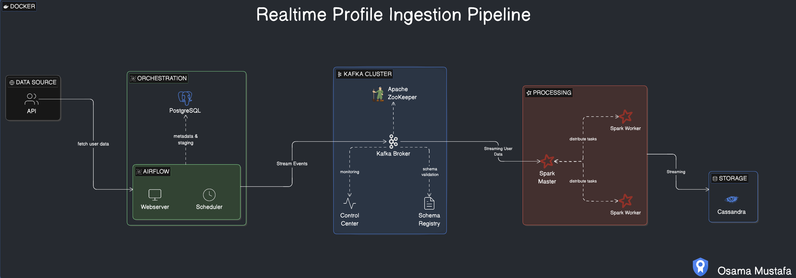
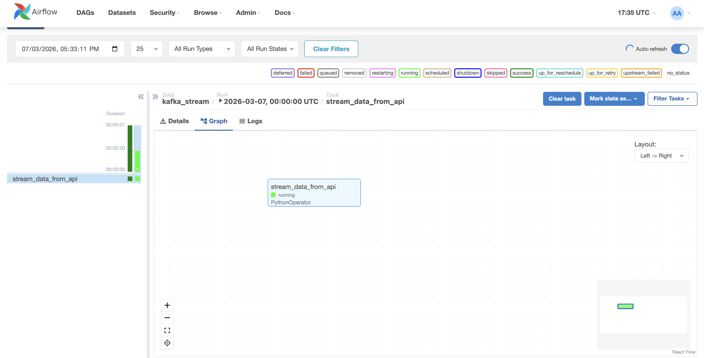
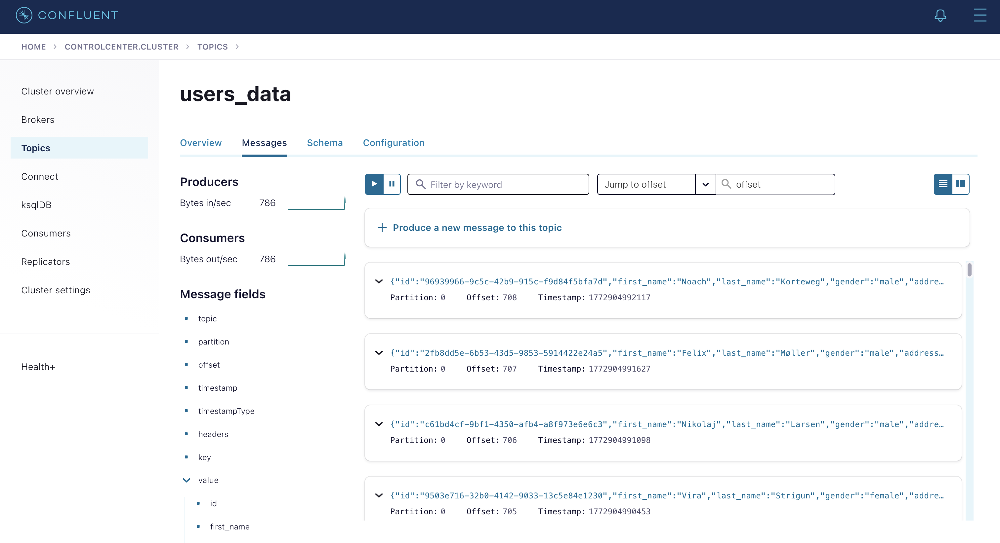
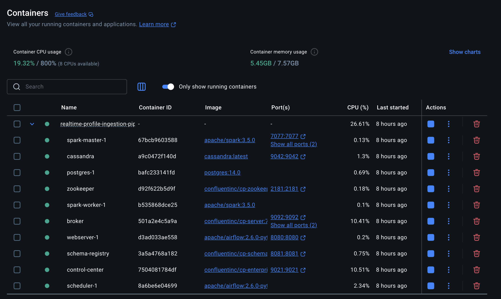
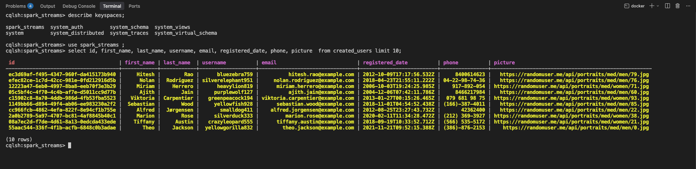

# Realtime Profile Ingestion Pipeline

An end-to-end real-time data engineering pipeline that fetches user profile data from an external API, streams it through Apache Kafka, processes it with Apache Spark Structured Streaming, and persists it into Apache Cassandra — all orchestrated by Apache Airflow and fully containerized with Docker.
## Contents

- [Architecture](#architecture)
- [Data Ingestion & Orchestration](#data-ingestion--orchestration)
- [Kafka Cluster](#kafka-cluster)
- [Stream Processing](#stream-processing)
- [Storage](#storage)
- [Tech Stack](#tech-stack)
- [Setup & Usage](#setup--usage)

## Architecture



The pipeline is composed of four core stages: **Data Ingestion & Orchestration**, **Kafka Cluster**, **Stream Processing**, and **Storage**. Each stage is described in detail below.

---

## Data Ingestion & Orchestration

Apache Airflow orchestrates the entire ingestion workflow. A scheduled DAG (`kafka_stream`) triggers a Python task that continuously fetches random user profiles from the [Random User API](https://randomuser.me/) and publishes them as JSON messages to a Kafka topic. PostgreSQL serves as the metadata store for Airflow, while the Webserver and Scheduler run as separate containers.



---

## Kafka Cluster

The Kafka cluster handles all event streaming. It consists of:

- **Apache Zookeeper** — manages broker coordination and leader election.
- **Kafka Broker** — receives user profile events from the Airflow producer and makes them available to downstream consumers.
- **Schema Registry** — provides centralized schema management for Kafka topics.
- **Control Center** — a web UI for monitoring broker health, topics, consumer lag, and throughput.



---

## Stream Processing

Apache Spark Structured Streaming acts as the real-time consumer. A PySpark job (`spark_stream.py`) subscribes to the `users_data` Kafka topic, deserializes the JSON payloads, and maps them to a structured DataFrame. The Spark cluster runs with a dedicated Master and Worker node.



---

## Storage

Apache Cassandra is the final sink. The Spark streaming job writes each processed user record into the `spark_streams.created_users` table using the Spark Cassandra Connector. Cassandra's distributed architecture ensures low-latency reads and high write throughput.



---

## Tech Stack

- Apache Airflow
- Apache Kafka
- Apache Zookeeper
- Apache Spark
- Apache Cassandra
- PostgreSQL
- Docker
- Python

---

## Setup & Usage

### 1. Clone the Repository

```bash
git clone https://github.com/<your-username>/Realtime-Profile-Ingestion-Pipeline.git
cd Realtime-Profile-Ingestion-Pipeline
```

### 2. Install Requirements

The project contains two requirement files:

- **`requirements.txt`** — Python dependencies installed _inside_ the Airflow containers at startup (`kafka-python`, `requests`). You do not need to install these locally.
- **`requirements-local.txt`** — Dependencies for running the Spark streaming job on your local machine (`pyspark`, `cassandra-driver`). Only needed if you want to run `spark_stream.py` outside of Docker.

```bash
# Only required if running the Spark job locally
pip install -r requirements-local.txt
```

### 3. Run the Pipeline

```bash
docker compose up -d
```

### 4. Submit the Spark Streaming Job (Local)

Make sure Java 17+ is installed, then run:

```bash
python spark_stream.py
```

The script consumes from the `users_data` Kafka topic and writes to Cassandra.
